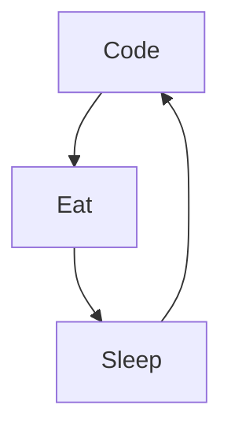

<h1 align="center">Hi 👋, I'm ShHaWkK</h1>
<h3 align="center">Beginner Developer</h3>

  </img>
  

<h3 align="left">Languages and Tools:</h3>

* ❤️ I love programming, break my head

 
     
   
   
   
    
  <h2>DevOps</h2>
   
  <h2>Web</h2>
   
   
    
  <h2>Versioning</h2>
  

  <h2>Object-oriented programming</h2>
  
  <h2>3D</h2>
   
   

  <h2>Design</h2>
    
   
  <h2>Databases</h2>
   
  
    
  

  <h3>SoftWare</h3>
  

<h3>Virtualization</h3>

  

<h3 align="left">Connect with me:</h3>

### My daily Routine : 

