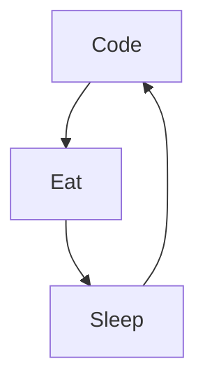

<body>
<h1 align="center"> ⬇️ 𝙒𝙚𝙡𝙘𝙤𝙢𝙚 𝙩𝙤 𝙢𝙮 𝙥𝙧𝙤𝙛𝙞𝙡𝙚 ⬇️ </h1>

<!-- Social icons section -->

<h1 align="center">Hi 👋, I'm ShHaWkK :blush:</h1>
  
  

<h3 align="center">Beginner Developer</h3> 

  </img>

<h3 align="left">💻 Software and Tools</h3>

  
  
  
  
  
  
  
  
  
  
  
  
  
  
  
  
  
  
  
  
  
  

<!-- Social icons section -->
<h3 align="left">Connect with me:</h3>

  

### My daily Routine : 

<h3 align="left">Badge</h3>
 
 
 
 
 

<h3 align="left">Stats</h3>

<h3 aligne="center">Ressources</h3>

[readme-typing-svg](https://github.com/denvercoder1/readme-typing-svg)  

[streak_Stats](https://github.com/DenverCoder1/github-readme-streak-stats)

</body>
