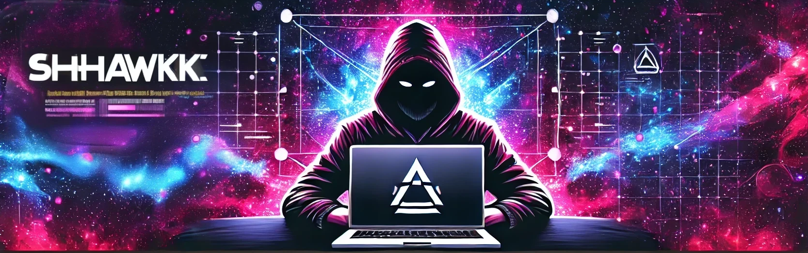
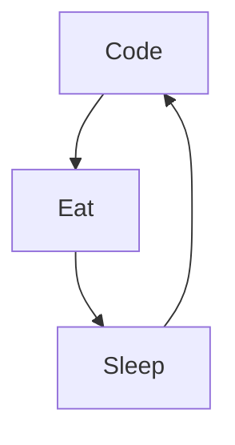

<body>
  

    
  

<h1 align="center"> ⬇️ 𝙒𝙚𝙡𝙘𝙤𝙢𝙚 𝙩𝙤 𝙢𝙮 𝙥𝙧𝙤𝙛𝙞𝙡𝙚 ⬇️ </h1>
<!-- Social icons section -->

<!-- Typing SVG animation -->
  
  

  

    
    <h3>Junior Developer & System and Network Administrator</h3>
    
  

  </img>

  <!-- About Me Section -->
  <h2 align="center">👋 About Me</h2>
  

    Passionate about technology, programming, and system administration. I enjoy solving complex problems and learning new technologies!
  

<h3 align="left">💻 Software and Tools</h3>
 

  <!-- Python -->
  
  
  <!-- TypeScript -->
  
  
  <!-- Regex -->
  
  
  <!-- Linux -->
  
  
  <!-- React -->
  
  
  <!-- Next.js -->
  
  
  <!-- Node.js -->
  
  
  <!-- Bootstrap -->
  
  
  <!-- C -->
  
  
  <!-- Docker -->
  
  
  <!-- HTML5 -->
  
  
  <!-- JavaScript -->
  
  
  <!-- PHP -->
  
  
  <!-- Git -->
  
  
  <!-- Java -->
  
  
  <!-- Unity -->
  
  
  <!-- C# -->
  
  
  <!-- CSS3 -->
  
  
  <!-- Figma -->
  
  
  <!-- Microsoft SQL Server -->
  
  
  <!-- MySQL -->
  
  
  <!-- Oracle <a href="https://www.oracle.com/" target="_blank" rel="noreferrer">
    
-->
  
  
  
  
  

<!-- Contact Section -->
<h2>📫 Contact Me</h2>

  

  

shhawk

  

<!-- Daily Routine Diagram -->

<h2>🕒 My Daily Routine</h2>

```mermaid
    graph TD; 
        Code-->Eat; 
        Eat-->Sleep;
        Sleep-->Code;
```

<!-- Stats Section 
<h2>📊 GitHub Stats</h2>

-->

<!-- Languages Chart -->

<!-- Trophies Section -->
<h2>🏆 GitHub Trophies</h2>

  

<!-- Resources Section -->
<h2>📚 Resources</h2>

- [readme-typing-svg](https://github.com/denvercoder1/readme-typing-svg)  
- [streak_Stats](https://github.com/DenverCoder1/github-readme-streak-stats)

</body>

        

