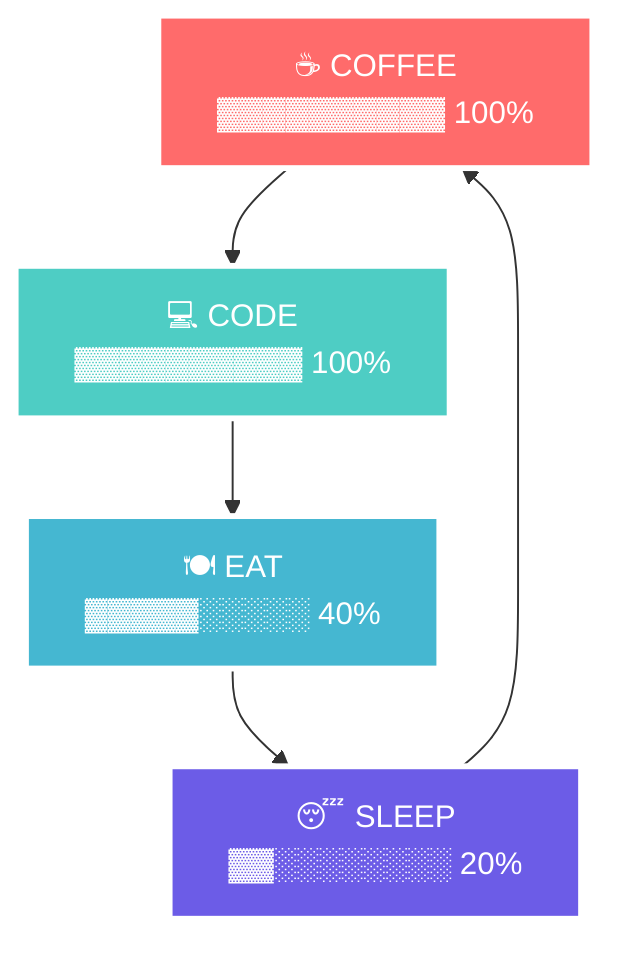

<h1 align="center"> ⬇️ 𝙒𝙚𝙡𝙘𝙤𝙢𝙚 𝙩𝙤 𝙢𝙮 𝙥𝙧𝙤𝙛𝙞𝙡𝙚 ⬇️ </h1>

<div align="center">
  
[](https://git.io/typing-svg)


<br/>


</div>

<div align="center">
  
</div>

---


<table width="100%">
<tr>
<td width="50%">

<div align="left">

## 🌟 HUMAN.EXE PROFILE

**🧠 Personality:** INFJ-A - The Architect  
**💼 Role:** Junior Developer & System Administrator  & Analyst SOC 
**🎯 Mission:** Solving complex problems & learning cutting-edge technologies  
**❤️ Passion:** Breaking things to understand how they work  

[](https://git.io/typing-svg)

</div>

</td>
<td width="50%">

<div align="center">

### ⚡ NEURAL METRICS

| 🔥 **Attribute** | 📊 **Level** | 🎯 **Status** |
|:---:|:---:|:---:|
| **Coding Addiction** |  | `MAXIMUM` |
| **Coffee Dependency** |  | `INFINITE` |
| **Debug Mastery** |  | `EXPERT` |
| **Sleep Schedule** |  | `CHAOTIC` |

</div>

</td>
</tr>
</table>


---

<div align="center">
  
[](https://git.io/typing-svg)

</div>

### 💻 **CORE PROGRAMMING LANGUAGES**

<div align="center">
  


</div>

<table width="100%">
<tr>
<td align="center" width="14.28%">

<br/>🐍 Code Beast
</td>
<td align="center" width="14.28%">

<br/>⚡ Web Wizard
</td>
<td align="center" width="14.28%">

<br/>🛡️ Type Guardian
</td>
<td align="center" width="14.28%">

<br/>⚙️ System Core
</td>
<td align="center" width="14.28%">

<br/>🎮 Game Engine
</td>
<td align="center" width="14.28%">

<br/>☕ Enterprise
</td>
<td align="center" width="14.28%">

<br/>🌐 Web Backend
</td>
</tr>
</table>

### 🌐 **FRONTEND & FRAMEWORKS**

<div align="center">
  


</div>

<table width="100%">
<tr>
<td align="center" width="16.66%">

<br/>🏗️ Structure
</td>
<td align="center" width="16.66%">

<br/>🎨 Style Master
</td>
<td align="center" width="16.66%">

<br/>⚛️ Component
</td>
<td align="center" width="16.66%">

<br/>🚀 Framework
</td>
<td align="center" width="16.66%">

<br/>📱 Responsive
</td>
<td align="center" width="16.66%">

<br/>🎯 Design
</td>
</tr>
</table>

### 🛠️ **BACKEND & DEVOPS**

<div align="center">
  


</div>

<table width="100%">
<tr>
<td align="center" width="16.66%">

<br/>🟢 Runtime
</td>
<td align="center" width="16.66%">

<br/>🐳 Container
</td>
<td align="center" width="16.66%">

<br/>🔄 Version Control
</td>
<td align="center" width="16.66%">

<br/>🐧 System
</td>
<td align="center" width="16.66%">

<br/>🐬 Database
</td>
<td align="center" width="16.66%">

<br/>🐘 Advanced DB
</td>
</tr>
</table>

### 🎮 **GAME DEVELOPMENT & TOOLS**

<div align="center">
  

<br/>


</div>


---

<div align="center">
  
[](https://git.io/typing-svg)

</div>

<div align="center">


```mermaid
graph TD
    A["☕ COFFEE<br/>▓▓▓▓▓▓▓▓▓▓ 100%"] --> B["💻 CODE<br/>▓▓▓▓▓▓▓▓▓▓ 100%"]
    B --> C["🍽️ EAT<br/>▓▓▓▓▓░░░░░ 40%"]
    C --> D["😴 SLEEP<br/>▓▓░░░░░░░░ 20%"]
    D --> A
    
    style A fill:#ff6b6b,stroke:#fff,stroke-width:3px,color:#fff
    style B fill:#4ecdc4,stroke:#fff,stroke-width:3px,color:#fff  
    style C fill:#45b7d1,stroke:#fff,stroke-width:3px,color:#fff
    style D fill:#6c5ce7,stroke:#fff,stroke-width:3px,color:#fff
```

</div>

<div align="center">
  
[%7B+code();+coffee();+%7D;Code+%E2%86%92+Coffee+%E2%86%92+Debug+%E2%86%92+Repeat+%E2%86%92+∞)](https://git.io/typing-svg)

</div>


---

<div align="center">
  
[](https://git.io/typing-svg)

</div>

<table width="100%">
<tr>
<td width="33%" align="center">

### 🔴 **ROOT-ME WARRIOR**

<div align="center">
  
   <br/><br/>
</div>

```bash
┌─[shhawk@root-me]─[~]
└──╼ $ ./exploit.py
[+] Web Security: 68% ████████░░
[+] Cryptography: 35% ████░░░░░░  
[+] Network: 72% ████████░░
[+] System: 55% ██████░░░░
[+] Rank: #2847 📈
```


</td>
<td width="33%" align="center">

### 🎓 **PWN.COLLEGE STUDENT**

<div align="center">
  
  [](https://pwn.college/hacker/ShHawk)
  <!--  -->
  <br/><br/>
  
</div>

```python
#!/usr/bin/env python3
class PwnCollege:
    def __init__(self):
        self.username = "ShHaWkK"
        self.learning = True
        self.progress = "Rising"
    
    def hack_the_world(self):
        return "🚀 Learning Complete!"
```

[](https://pwn.college/hacker/ShHawk)


</td>
<td width="33%" align="center">

### 🏆 **CCNA CERTIFIED**

<div align="center">
  
  <br/><br/>
</div>

```cisco
Router(config)# show version
CCNA Certification: ACTIVE ✅
Network Mastery: ACHIEVED 🌐
Routing & Switching: EXPERT
```

**🎯 Networking Expert**  
**📜 Certified Professional**  
**🔧 Enterprise Ready**

</td>
</tr>
</table>


---

<div align="center">
  
[](https://git.io/typing-svg)

</div>

<div align="center">
  


</div>

<div align="center">
  


</div>

<div align="center">
  


</div>


---

<div align="center">
  
[](https://git.io/typing-svg)

</div>

<table width="100%">
<tr>
<td width="50%" align="center">

### 💬 **DISCORD **

<div align="center">
  
  <br/><br/>
  
</div>

**🎯 Username:** `shhawk`  
**🟢 Status:** Always Online  
**🎮 Activity:** Coding & Gaming  

<a href="https://discord.gg/TS6w3TYZRM">

</a>

</td>
<td width="50%" align="center">

### 💼 **LINKEDIN PROFESSIONAL**

<div align="center">
  
  <br/><br/>
  
</div>

**👤 Name:** Alexandre Uzan  
**💼 Role:** Analyste SOC / Gouvernance  
**🎯 Focus:** Cybersecurity  
**📈 Status:** Open to Opportunities  

<a href="https://www.linkedin.com/in/alexandre-uzan-b65923256/">

</a>

</td>
</tr>
</table>

<table width="100%">
<tr>
<td width="50%" align="center">

### 🔴 **ROOT-ME HACKER**

<div align="center">
  
  <br/><br/>
</div>

**🎯 Username:** `ShHawk`  
**🏆 Rank:** Rising Star  
**🔥 Focus:** Web Security  
**📊 Progress:** Advancing  

<a href="https://www.root-me.org/ShHawk?lang=fr">

</a>

</td>
<td width="50%" align="center">

### 🎓 **PWN.COLLEGE STUDENT**

<div align="center">
  
  <br/><br/>
  
</div>

**🎯 Username:** `ShHawk`  
**📚 Status:** Learning  
**🚀 Goal:** Binary Exploitation, ROP, Dynamic Allocator Misuses, Reverse, Intermediate Memory Errors
**🏆 Progress:** Advancing  


</td>
</tr>
</table>

<div align="center">
  
### 🌟 **UNIVERSAL HANDLE: `shhawk`**
*Find me across all platforms with this legendary username!*

</div>


---

<div align="center">
  
[](https://git.io/typing-svg)

</div>

<details>
<summary>🔐 <b>🏆 ULTIMATE HACKER CHALLENGE 🏆</b> (Click if you dare)</summary>

<div align="center">
  


[](https://git.io/typing-svg)

</div>

```
🔥 LEGENDARY CIPHER CHALLENGE 🔥
═══════════════════════════════════

UWJ1WnV6aFJhVzUzYVdKRmRVeFlhbGRrU0E9PQ==

═══════════════════════════════════
```

**🧩 HACKER'S HINT:**  
*Two encryption layers protect this secret. Classic cipher meets modern encoding.*  
*Only true digital warriors can unlock the mystery within...*

**🏆 LEGENDARY REWARD:**  
*Send the decrypted message to `shhawk` on Discord for exclusive hacker status!*  
*First to solve gets a special digital badge and eternal bragging rights!*

**⚡ DIFFICULTY LEVEL:** `LEGENDARY` 🔥🔥🔥🔥🔥

</details>


---

<div align="center">

[](https://git.io/typing-svg)


</div>

---

<div align="center">

### 📚 **LEGENDARY RESOURCES**
[readme-typing-svg](https://github.com/denvercoder1/readme-typing-svg) • [GitHub Stats](https://github.com/anuraghazra/github-readme-stats) • [Skill Icons](https://github.com/tandpfun/skill-icons) • [Profile Trophy](https://github.com/ryo-ma/github-profile-trophy)

</div>
